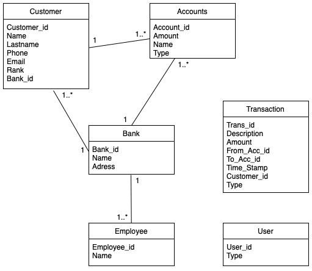
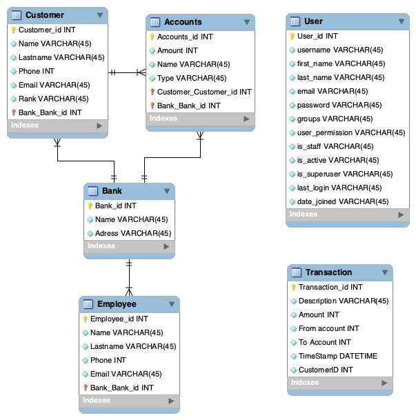

# Hackathon

We are making an Banking system for this assignment.

These are the requirements for the system:

A customer can have any number of bank accounts
For future multi-factor authentication, we must record the customer's telephone number
The bank ranks its customers into three groups: basic, silver, and gold - the system must keep track of this information
Customers ranked silver and gold can loan money from the bank
Customers can make payments on their loans
Customers can transfer money from their accounts if the account balance is sufficient
Customers can view their accounts, accounts movements, and accounts balance
Bank employees can view all customers and accounts
Bank employees can create new customers and accounts and change customer rank
Use Python 3.9 or newer, Django 4.0 or newer

Your project should be documented appropriately (e.g., ER-Diagram, short intro), but you are not supposed to write a report.

### User Stories

## Conceptuel Model 

## ER Diagram

## Running the project
Once the project is on your local machine, run the following commands in the terminal.
1. Run `python manage.py makemigrations`
 
2. Run `python manage.py migrate`

3. Run `python manage.py runserver`

**Note:** `python manage.py makemigrations` and `python manage.py migrate` should only be run if changes to the model classes has occurred.
